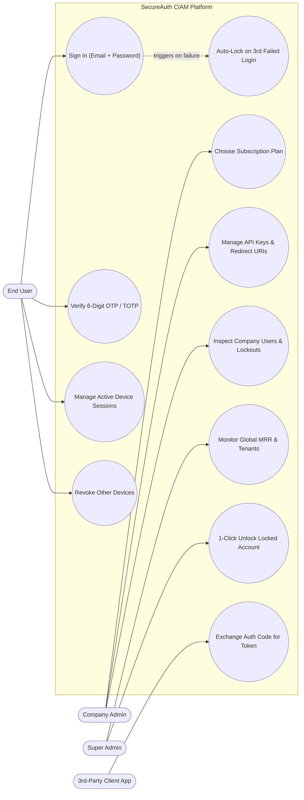
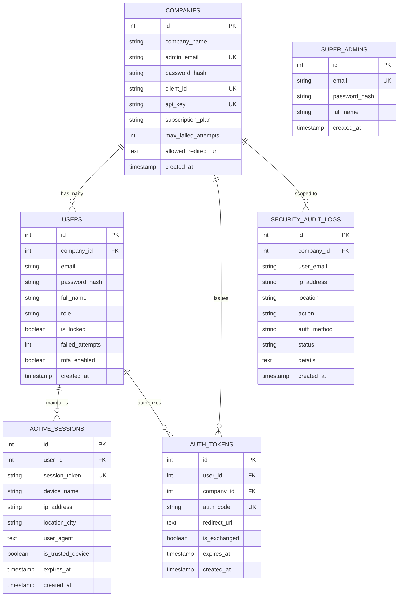
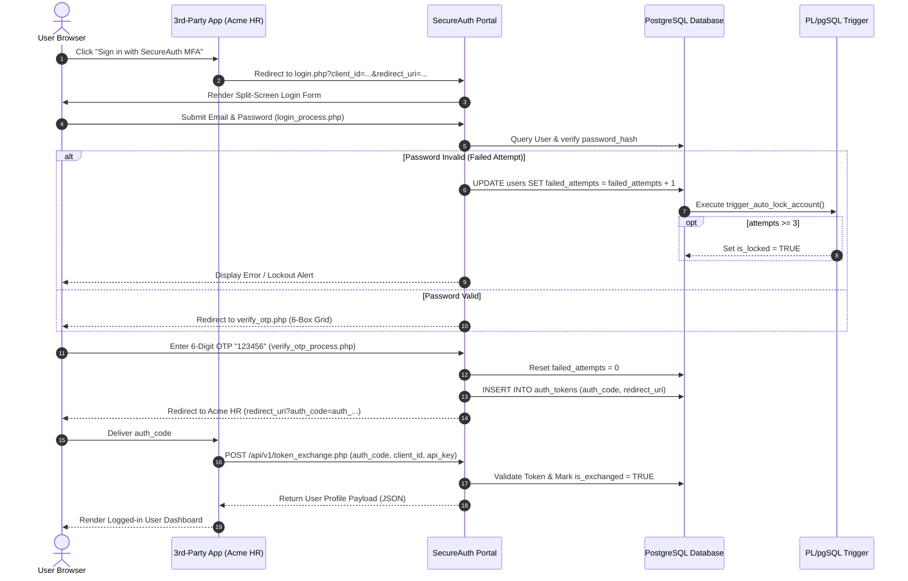
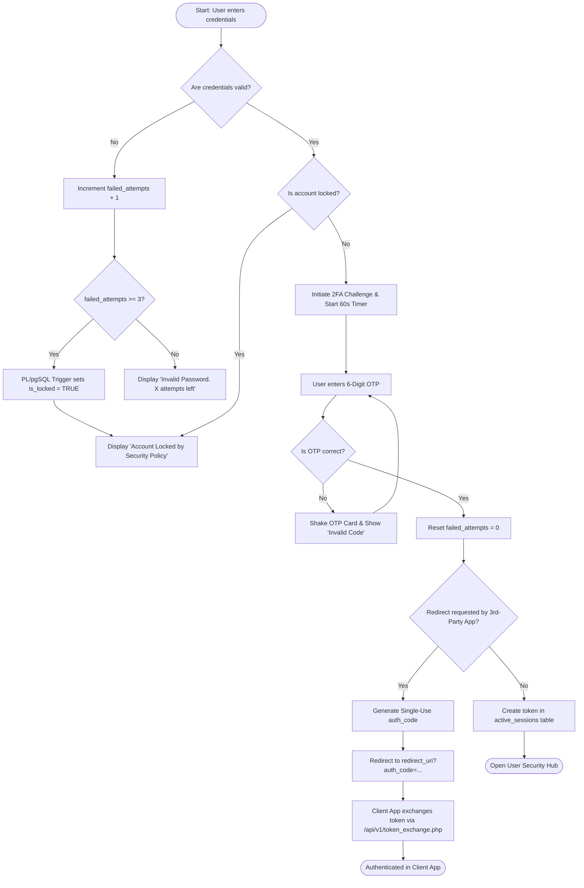
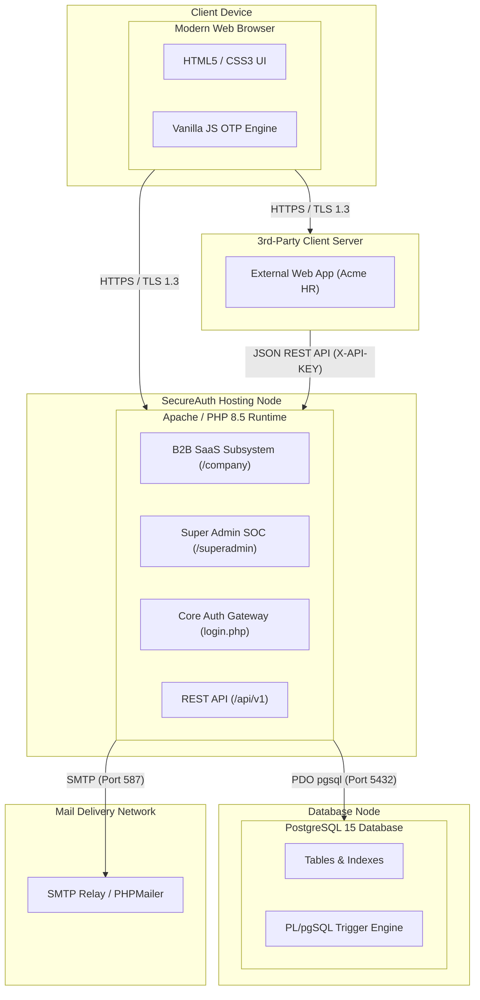

# 🛡️ SecureAuth: Multi-Tenant CIAM & Multi-Factor Authentication (MFA) Portal

> **A modern, corporate-grade "Authentication-as-a-Service" (CIAM) platform built with Vanilla PHP 8, PostgreSQL with PL/pgSQL Triggers, HTML5, CSS3, and Vanilla JavaScript.**

---

## 📖 1. Project Overview (In Simple Words)

In modern web security, passwords alone are no longer enough. Hackers use automated bots to guess passwords or reuse stolen credentials. **SecureAuth** solves this with a **Two-Door Security Architecture**:

1. **Door 1 (Primary Credentials):** The user enters their corporate email and password. A database-level **PL/pgSQL Trigger** tracks failed attempts and automatically locks the account if someone fails 3 times in a row.
2. **Door 2 (Multi-Factor Challenge):** The user must enter a **6-digit One-Time Security Passcode (Email OTP)** dispatched to their registered email, using modern auto-focusing input boxes with a live 60-second countdown timer.

### 🏢 B2B Multi-Tenancy (Auth-as-a-Service)
Just like industry solutions such as **Auth0** or **Clerk**, other companies can subscribe to SecureAuth, obtain developer **API Keys** (`client_id` & `api_key`), choose a subscription tier (`Starter`, `Pro`, `Enterprise`), and plug SecureAuth MFA directly into their own software using a single redirect button.

---

## 📁 2. File & Directory Guide (What Each File Does)

| Directory / File | Type | Purpose & Description |
| :--- | :--- | :--- |
| **`index.php`** | PHP/HTML | Public SaaS product landing page. Displays marketing hero, architectural features, live subscription plans, and quick demo switcher. |
| **`database/pg_schema.sql`** | SQL | Complete PostgreSQL database schema. Contains all 7 tables, high-speed indexes, seed demo data, and the **`trigger_auto_lock_account()`** PL/pgSQL trigger. |
| **`config/db.php`** | PHP | Connects PHP to PostgreSQL using **PDO** (`pgsql:host=...;dbname=...`). Handles connection exceptions gracefully. |
| **`includes/auth_helper.php`** | PHP | The security backbone. Starts secure sessions, generates/verifies **CSRF tokens**, gets client IP/device info, logs security audit events, and provides role guards (`require_login()`, `require_admin()`, `require_company_login()`, `require_superadmin()`). |
| **`assets/css/style.css`** | CSS | Complete corporate design system. Includes CSS variables (`:root`), split-screen layouts, floating labels, password strength meters, 6-digit OTP grid, responsive breakpoints, and pricing cards. |
| **`assets/js/auth.js`** | JS | Interactive frontend engine. Handles 6-box OTP auto-advance, smart backspace, full 6-digit clipboard paste (`Ctrl+V`), 60-second countdown timer, password show/hide eye toggle, and real-time password strength scoring. |
| **`login.php`** | PHP/HTML | Public split-screen login page. Displays corporate hero branding on the left and floating-label login on the right. Automatically supports `?client_id=...` for partner branding. |
| **`login_process.php`** | PHP | Handles login submission. Verifies password hash using `password_verify()`. If wrong, increments failed attempts in PostgreSQL (firing the lockout trigger). If correct, generates OTP challenge and redirects to `verify_otp.php`. |
| **`register.php`** | PHP/HTML | Public registration page with real-time password complexity meter. |
| **`register_process.php`** | PHP | Validates user input, hashes password using `password_hash($pass, PASSWORD_BCRYPT)`, creates the user under their company partition, and assigns default TOTP. |
| **`verify_otp.php`** | PHP/HTML | Dedicated 6-digit OTP verification screen. Features 4 method selector tabs (App TOTP, Email OTP, SMS, Backup Code) and 6 separate input boxes. |
| **`verify_otp_process.php`** | PHP | Validates the 6-digit code. Resets failed attempts to 0. If coming from an external client app, issues a single-use `auth_code` and redirects back. If direct login, creates an entry in `active_sessions` and opens the dashboard. |
| **`user_dashboard.php`** | PHP/HTML | End-User Personal Security Hub. Displays profile metrics, active device sessions, recent login audit history, and the **"Log out of all other devices"** button. |
| **`revoke_sessions.php`** | PHP | Revokes all active session tokens for the current user except the browser they are currently using. |
| **`logout.php`** | PHP | Deletes the session token from `active_sessions`, clears `$_SESSION`, expires the session cookie, and redirects to login. |
| **`company/register.php`** | PHP/HTML | B2B onboarding page. Client companies sign up and pick a plan (`Starter`, `Pro`, `Enterprise`). |
| **`company/register_process.php`**| PHP | Provisions a new company, hashes admin password, and generates unique cryptographic `client_id` and `api_key`. |
| **`company/login.php`** | PHP/HTML | Login portal exclusively for Company Administrators. |
| **`company/dashboard.php`** | PHP/HTML | B2B Developer Console. Displays `Client ID`, `API Key`, ready-to-copy HTML button integration code, end-user directory, and company security telemetry. |
| **`superadmin/login.php`** | PHP/HTML | Master supervisory login for platform owners (`superadmin@secureauth.io`). |
| **`superadmin/dashboard.php`** | PHP/HTML | Platform Master SOC. Tracks Monthly Recurring Revenue (MRR), total tenant companies, cross-tenant user count, and global intrusion audit logs. |
| **`api/v1/token_exchange.php`** | PHP/REST | REST API endpoint where external software sends `auth_code`, `client_id`, and `api_key` to exchange for verified user identity JSON payload. |
| **`api/check_email_ajax.php`** | PHP/JSON | Asynchronous endpoint querying PostgreSQL via PDO to verify if an email is registered without page reload. |
| **`api/unlock_user_ajax.php`** | PHP/JSON | Admin/Superadmin AJAX endpoint unlocking accounts in PostgreSQL and returning JSON telemetry. |
| **`assets/js/ajax_features.js`** | JS/jQuery | Implements live email checking via `$.ajax()` and 1-click admin unlocking via `$.post()` with smooth DHTML animations. |
| **`demo_client_app.php`** | PHP/HTML | A realistic 3rd-party mock application (*"Acme Enterprise HR Cloud"*) that demonstrates how external websites integrate "Sign in with SecureAuth MFA". |

---

## 🔄 3. Deep-Dive Workflow & Architecture (From Start to End)

Let's break down the exact flow from the moment a user clicks until data hits the database:

### Step 1: Company Onboarding (B2B SaaS Level)
1. A company visits [`company/register.php`](file:///Users/nikhil/Downloads/anti-mfa/company/register.php) and enters their Organization Name and Admin Email, and selects a plan (`Starter`, `Pro`, or `Enterprise`).
2. [`company/register_process.php`](file:///Users/nikhil/Downloads/anti-mfa/company/register_process.php) generates:
   * **`client_id`** (e.g. `client_acme_demo_123`) &rarr; Used publicly in login buttons.
   * **`api_key`** (e.g. `sk_live_...`) &rarr; Kept secret in the company's backend.
3. The company admin accesses [`company/dashboard.php`](file:///Users/nikhil/Downloads/anti-mfa/company/dashboard.php) and copies the integration snippet into their web application.

---

### Step 2: 3rd-Party Software Integration Flow
1. An employee visits the client software ([`demo_client_app.php`](file:///Users/nikhil/Downloads/anti-mfa/demo_client_app.php)) and clicks **"Sign In with SecureAuth MFA"**.
2. The browser is redirected to:
   ```
   http://localhost:8000/login.php?client_id=client_acme_demo_123&redirect_uri=http://localhost:8000/demo_client_app.php
   ```
3. [`login.php`](file:///Users/nikhil/Downloads/anti-mfa/login.php) reads `client_id`, calls `get_company_by_client_id($pdo, $clientId)`, and dynamically displays:
   *`🏢 Authenticating for Acme Enterprise HR`*

---

### Step 3: First-Door Authentication & Database Auto-Lock Trigger
1. The user submits their email and password to [`login_process.php`](file:///Users/nikhil/Downloads/anti-mfa/login_process.php).
2. **Password Verification:** The script runs `password_verify($password, $user['password_hash'])`.
3. **If Password Fails:**
   * PHP runs: `UPDATE users SET failed_attempts = failed_attempts + 1 WHERE id = ?`.
   * **PL/pgSQL Trigger Fires:** In PostgreSQL, the `trg_check_failed_attempts` trigger automatically executes:
     ```sql
     IF NEW.failed_attempts >= 3 THEN
         NEW.is_locked = TRUE;
     END IF;
     ```
   * Even if the PHP backend had a bug, the database itself guarantees that the account is locked on the 3rd failed attempt!
   * An audit log is inserted into `security_audit_logs` with status `FAILED` or `LOCKED`.
4. **If Password Succeeds:**
   * PHP sets temporary session state: `$_SESSION['mfa_pending_user_id'] = $user['id']`.
   * An audit event `MFA_CHALLENGE` is logged.
   * User is redirected to [`verify_otp.php`](file:///Users/nikhil/Downloads/anti-mfa/verify_otp.php).

---

### Step 4: Second-Door Authentication (6-Digit OTP Challenge)
1. [`verify_otp.php`](file:///Users/nikhil/Downloads/anti-mfa/verify_otp.php) renders 6 separate input boxes.
2. [`assets/js/auth.js`](file:///Users/nikhil/Downloads/anti-mfa/assets/js/auth.js) manages the UX:
   * When user types a number &rarr; Automatically focuses the next box.
   * When user presses Backspace on an empty box &rarr; Moves focus to previous box.
   * When user pastes a code (`Ctrl+V` / `Cmd+V`) &rarr; Auto-fills all 6 boxes and automatically submits the form!
   * A 60-second timer counts down before enabling the "Resend Code" link.
3. The user submits code to [`verify_otp_process.php`](file:///Users/nikhil/Downloads/anti-mfa/verify_otp_process.php).
4. When validated (`123456` or TOTP algorithm match):
   * Reset `failed_attempts = 0`.
   * Log audit event `OTP_VERIFIED` with status `SUCCESS`.

---

### Step 5: Session Issuance & OAuth-Style Code Exchange
* **If it was a 3rd-Party Integration Redirect:**
  1. [`verify_otp_process.php`](file:///Users/nikhil/Downloads/anti-mfa/verify_otp_process.php) generates a single-use authorization code: `auth_code = 'auth_' . bin2hex(...)`.
  2. Inserts it into `auth_tokens` with a 10-minute expiry.
  3. Redirects the browser back to: `http://localhost:8000/demo_client_app.php?auth_code=auth_...`.
  4. The client app server calls [`api/v1/token_exchange.php`](file:///Users/nikhil/Downloads/anti-mfa/api/v1/token_exchange.php) sending `auth_code`, `client_id`, and `api_key`.
  5. The API verifies the credentials, marks `is_exchanged = TRUE`, and returns the verified user JSON payload!
* **If it was a Direct Portal Login:**
  1. Generates a 64-character `session_token`.
  2. Inserts active device into `active_sessions` (30-day or 1-day token).
  3. Redirects user to [`user_dashboard.php`](file:///Users/nikhil/Downloads/anti-mfa/user_dashboard.php).

---

## 📊 4. UML Diagrams

### 1. Use Case Diagram
Shows what each actor (End-User, Company Admin, Platform Super Admin, 3rd-Party App) can do in the system:



---

### 2. Entity-Relationship (ER) Diagram
Shows all 6 database tables, their relationships, and foreign keys:



---

### 3. Sequence Diagram (End-to-End Authentication & Redirect Flow)
Shows the exact chronological step-by-step communication between Browser, Client App, SecureAuth PHP, PostgreSQL, and Triggers:



---

### 4. Activity Diagram (Decision Flowchart)
Visualizes how inputs and security checks branch through the system:



---

### 5. Deployment Diagram
Shows the physical and logical deployment architecture:



---

## ✉️ 5. How the Email OTP Module Connects (PHPMailer)

In [`verify_otp.php`](file:///Users/nikhil/Downloads/anti-mfa/verify_otp.php), you will see the **Email OTP tab**.

To connect live email dispatching via **PHPMailer**:
1. Install PHPMailer via Composer:
   ```bash
   composer require phpmailer/phpmailer
   ```
2. When the user switches to the **Email OTP** tab or requests a resend, PHP calls a mailer helper function:
   ```php
   use PHPMailer\PHPMailer\PHPMailer;
   
   function send_mfa_email($toEmail, $otpCode) {
       $mail = new PHPMailer(true);
       $mail->isSMTP();
       $mail->Host       = 'smtp.gmail.com'; // or SendGrid / Mailgun
       $mail->SMTPAuth   = true;
       $mail->Username   = 'your-email@gmail.com';
       $mail->Password   = 'your-app-password';
       $mail->SMTPSecure = PHPMailer::ENCRYPTION_STARTTLS;
       $mail->Port       = 587;

       $mail->setFrom('security@secureauth.io', 'SecureAuth Security');
       $mail->addAddress($toEmail);
       $mail->Subject = 'Your 6-Digit Verification Code';
       $mail->Body    = "Your login verification code is: {$otpCode}. It expires in 5 minutes.";
       $mail->send();
   }
   ```

---

## 🚀 6. Quickstart Setup Guide

### 1. Initialize PostgreSQL Database
In your Terminal:
```bash
dropdb secureauth_db && createdb secureauth_db
psql -d secureauth_db -f database/pg_schema.sql
```

### 2. Configure Database Credentials
Open [`config/db.php`](file:///Users/nikhil/Downloads/anti-mfa/config/db.php) and verify your PostgreSQL password on line 10.

### 3. Start Local Server
```bash
cd /Users/nikhil/Downloads/anti-mfa
php -S 127.0.0.1:8000
```

---

## 🔑 7. Demo Credentials Cheat Sheet

| Portal | URL | Demo Email | Password | OTP | Role |
| :--- | :--- | :--- | :--- | :--- | :--- |
| 🚀 **Client Integration Simulator** | `http://127.0.0.1:8000/demo_client_app.php` | `testuser@secureauth.com` | `password123` | `123456` | 3rd-Party Redirect Flow |
| 🏢 **Company B2B SaaS Console** | `http://127.0.0.1:8000/company/login.php` | `admin@acme.com` | `adminpass123` | N/A | Company Administrator |
| 👑 **Platform Super Admin SOC** | `http://127.0.0.1:8000/superadmin/login.php` | `superadmin@secureauth.io` | `adminpass123` | N/A | Platform Owner |
| 👤 **Direct User Portal** | `http://127.0.0.1:8000/login.php` | `testuser@secureauth.com` | `password123` | `123456` | End-User Security Hub |
| 🔒 **Locked Account Test** | `http://127.0.0.1:8000/login.php` | `intruder.target@corp.io` | `password123` | N/A | Trigger Auto-Lockout Test |

---

## 🏆 Project Achievements
* ✅ **Multi-Tenant CIAM:** Companies can register, pick subscription tiers, and get production API keys.
* ✅ **Hardware-Grade Protection:** PL/pgSQL database triggers lock accounts at 3 failed attempts.
* ✅ **Sleek UI/UX:** Split-screen layout, pure CSS floating labels, password strength meters.
* ✅ **Vanilla JS OTP:** 6 input boxes with auto-advancing, smart backspacing, clipboard paste support, and 60s countdown timer.
* ✅ **OAuth2 Integration:** Live redirect and REST token exchange simulating enterprise single-sign-on (SSO).
* ✅ **jQuery & AJAX Suite:** Live email validation and 1-click admin unlocking without page refresh.

---

## 🎓 8. Academic Syllabus & Topic Mapping (Units 3, 4, 5 & 6)

This project is fully structured to demonstrate all practical topics across **JSON, JavaScript/DHTML, jQuery, and AJAX**:

### 📦 Unit 3: JSON Basics
* **3.1 / 3.2 JSON Syntax, Objects & Arrays:** Structured JSON responses in [`api/v1/token_exchange.php`](file:///Users/nikhil/Downloads/anti-mfa/api/v1/token_exchange.php), [`api/check_email_ajax.php`](file:///Users/nikhil/Downloads/anti-mfa/api/check_email_ajax.php), and [`api/unlock_user_ajax.php`](file:///Users/nikhil/Downloads/anti-mfa/api/unlock_user_ajax.php).
* **3.4 Encoding (`json_encode()`):** Used in PHP to encode data objects and associative arrays into JSON strings sent to the browser.
* **3.5 Decoding (`json_decode()`):** Used in [`api/v1/token_exchange.php`](file:///Users/nikhil/Downloads/anti-mfa/api/v1/token_exchange.php) and [`demo_client_app.php`](file:///Users/nikhil/Downloads/anti-mfa/demo_client_app.php) to parse incoming JSON payloads into native PHP arrays.
* **3.6 / 3.7 Sending & Receiving JSON:** HTTP headers set via `header('Content-Type: application/json')` and input streamed via `file_get_contents('php://input')`.

### 🌐 Unit 4: JavaScript & DHTML
* **4.1 - 4.5 JavaScript Syntax, Variables, Control Flow & Functions:** Implemented throughout [`assets/js/auth.js`](file:///Users/nikhil/Downloads/anti-mfa/assets/js/auth.js) and [`assets/js/ajax_features.js`](file:///Users/nikhil/Downloads/anti-mfa/assets/js/ajax_features.js).
* **4.6 HTML DOM Events:** Event handling for `input`, `blur`, `click`, `keydown`, `paste`, dynamic countdown timers (`setInterval`), and real-time password entropy calculation.

### ⚡ Unit 5: jQuery
* **5.1 / 5.2 Inclusion & Library Setup:** jQuery 3.7.1 CDN included across registration and admin dashboards.
* **5.3 / 5.4 Syntax & Ready State:** `$(document).ready(function() { ... })` wrapper.
* **5.5 Basic Selectors (ID & Class):** `$('#reg_email')`, `$('#email-feedback')`, `$('.btn-unlock-ajax')`, `$(this).closest('tr')`.

### 🔄 Unit 6: AJAX
* **6.1 / 6.2 Classical AJAX Web Application Model (Using JSON):** Asynchronous request dispatching without full page reloads.
* **6.3 Database Connectivity via PHP & AJAX:** [`api/check_email_ajax.php`](file:///Users/nikhil/Downloads/anti-mfa/api/check_email_ajax.php) dynamically executes PostgreSQL queries via PDO and returns live status to the frontend.
* **6.4 Ajax jQuery Programs:** 
  * `$.ajax({ url: 'api/check_email_ajax.php', type: 'POST', dataType: 'json', data: {...}, success: ... })`
  * `$.post(endpointUrl, { user_id: ..., csrf_token: ... }, callback, 'json')`
  * Smooth DHTML DOM transitions with `.fadeOut(500)` upon unlocking accounts.

